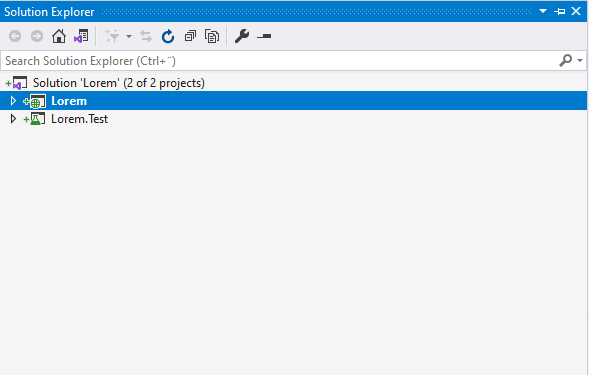
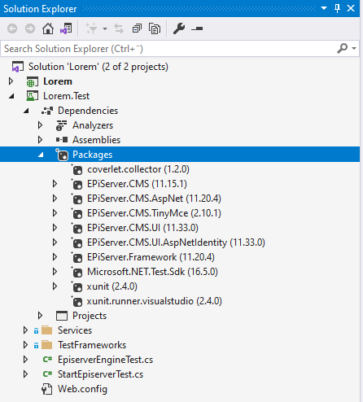
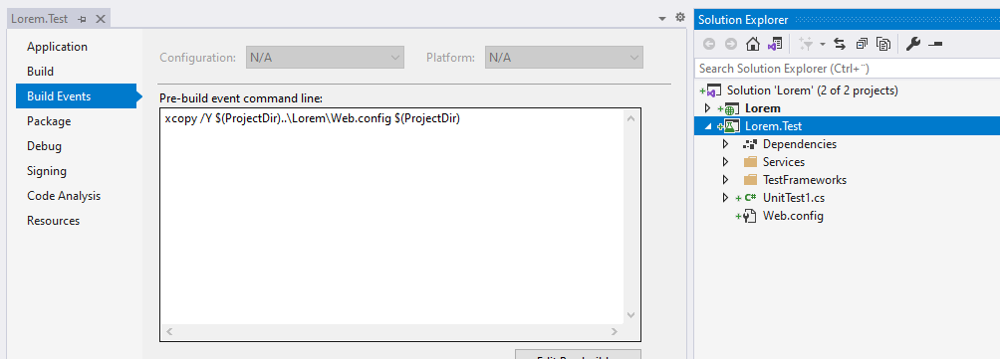
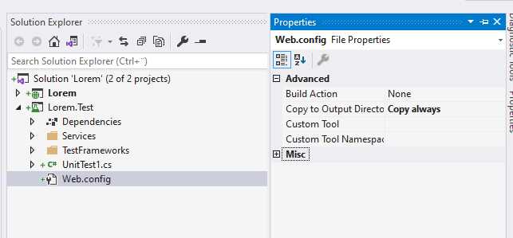
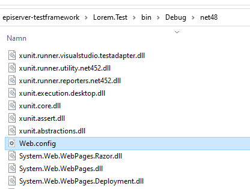

## Create a Episerver project

The easiest way to set up a new empty Episerver project is with [Episerver CMS Visual Studio Extension](https://marketplace.visualstudio.com/items?itemName=EPiServer.EpiserverCMSVisualStudioExtension).


### Activate Web.config transform

To activate web transforms when running a build, you will need to edit the project file and change the `Target Name="BeforeBuild"` element.

```xml
  <Target Name="BeforeBuild">
    <TransformXml Source="Web.config" Transform="Web.$(Configuration).config" Destination="Web.config" />
  </Target>
```

### OWIN authentication

The project should use OWIN authentication which you install by adding [EPiServer.CMS.UI.AspNetIdentity](https://nuget.episerver.com/package?id=EPiServer.CMS.UI.AspNetIdentity), follow the instructions on [world.episerver.com](https://world.episerver.com/documentation/developer-guides/CMS/security/episerver-aspnetidentity/) or the check the OwinInitialization file in the example project.

### Change the connection string

If you plan to run the tests in a pipeline, for example Azure DevOps, it is recommended that you use a LocalDB in the test configuration.

> Do not forget to create the database

```xml
  <connectionStrings>
    <add name="EPiServerDB"
      connectionString="Data Source=(LocalDb)\MSSQLLocalDB;Initial Catalog=Lorem;Integrated Security=true;MultipleActiveResultSets=True"
      providerName="System.Data.SqlClient"/>
  </connectionStrings>
```

> Agents that use the image [windows-latest](https://github.com/actions/virtual-environments/blob/main/images/win/Windows2019-Readme.md) in Azure Pipelines pool has support for LocalDB. Which makes it relatively easy to set up a test stage when someone makes a pull request or when it's time to send out a release.

### Change Episerver configuration
Change the with the following configuration in _Web.config_ so that Episerver will automatically create the tables in the database.

```xml
<episerver.framework createDatabaseSchema="true" updateDatabaseSchema="true">
```

## Create a test project

I have mostly used [xUnit](https://xunit.net/) so that is what I will show. But the code to run Episerver in test mode should work regardless of which test framework you choose. 

Start by adding a new project based on the _xUnit Test Project (.NET Core) template_ and then change _Target framework_ to _.NET Framework 4.8_


> Change the target framework to .NET Framework 4.8 in the project settings.



> Your solution should now have two projects: the episerver project and the test project.

### Add a project reference to the Episerver project

To test the code in the Episerver project you will need to add a project reference for it in the test project. You will also need to add the same version of the following nuget packages.

- EPiServer.CMS
- EPiServer.CMS.AspNet
- EPiServer.CMS.TinyMce
- EPiServer.CMS.UI
- EPiServer.CMS.UI.AspNetIdentity
- EPiServer.Framework



### Copy the Web.config

As default when you build the test project the build will include the configuration file from the Episerver project, but it will change name from Web.config to _*assembly name*.config_.  

Instead of building an implementation or adding another configuration file I have preferred to set up an xcopy the _Pre-build event command line_.



```bash
xcopy /Y $(ProjectDir)..\Lorem\Web.config $(ProjectDir)
```

In addition to copying _Web.config_ it will also need to be included in the project. It is also recommended to set it to _Copy always_ so it is always copied to output when the project is built.



If you run a build on the test project you should see the _Web.config_ in the build directory.



## Conclusion

Now you have a foundation and in the next chapter I will go through how to start Episerver in the test project.
