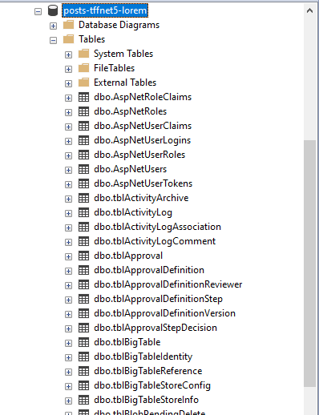

## Getting Started

To get started with integration testing, you can start by setting up a new Optimizely CMS 12 project using the information available [here]( https://github.com/episerver/netcore-preview). Then create a test project that for example uses [xUnit](https://xunit.net/), you will also need to add the nuget [Microsoft.AspNetCore.Mvc.Testing](https://www.nuget.org/packages/Microsoft.AspNetCore.Mvc.Testing).

> Don´t forget to create a database and update the connectionstring in the _appsettings.json_ or _appsettings.Development.json_

An example of a solution that contains an empty Optimizely CMS 12 with an associated test project, you can find the complete project [here](https://github.com/loremipsumdonec/episerver-testframework/tree/posts/test_framework_for_net5/posts/test_framework_for_net5/example).


If you start the web project, you will get a 404 error, which is not strange as there is no content, but if you look in the database, all tables and views will be there.



## Let's start

Now it's time to add the first test case where we are testing to start Episerver. We will need to use the `WebApplicationFactory<TEntryPoint>` class and use `Startup` from the web project as the entry point, you can find the code in the file [StartEpiserverTest.cs](https://github.com/loremipsumdonec/episerver-testframework/blob/posts/test_framework_for_net5/posts/test_framework_for_net5/example/Lorem.Test/StartEpiserverTest.cs)

```csharp
[Fact]
public void StartEpiserver_FirstTestCase_IContentRepositoryIsNotNull()
{
    var factory = new WebApplicationFactory<Startup>();

    IContentRepository repository = factory.Services.GetInstance<IContentRepository>();
    Assert.NotNull(repository);
}
```

If we run the above test case, we will get the following error message.

```bash
System.InvalidOperationException : No method 'public static IHostBuilder CreateHostBuilder(string[] args)' or 'public static IWebHostBuilder CreateWebHostBuilder(string[] args)' found on 'Lorem.Program'. Alternatively, WebApplicationFactory`1 can be extended and 'CreateHostBuilder' or 'CreateWebHostBuilder' can be overridden to provide your own instance.
```

Which is because `WebApplicationFactory<TEntryPoint>` by default tries to find a method named `CreateHostBuilder` in the same assembly as the `Startup` class that we specified as the entry point which look like this.

```csharp
public static IHostBuilder CreateHostBuilder(string[] args, bool isDevelopment)
{
    if (isDevelopment)
    {
        //Development configuration can be addded here, like local logging.
        return Host.CreateDefaultBuilder(args)
            .ConfigureCmsDefaults()
            .ConfigureWebHostDefaults(webBuilder =>
            {
            	webBuilder.UseStartup<Startup>();
            });
    }
    else
    {
        return Host.CreateDefaultBuilder(args)
            .ConfigureCmsDefaults()
            .ConfigureWebHostDefaults(webBuilder =>
            {
                webBuilder.UseStartup<Startup>();
            });
    }
}
```

The reason is that the `WebApplicationFactory<TEntryPoint>` looks for a method with a `string[]args`  parameter. To solve this we have to remove the `isDevelopment` parameter.

```csharp
public static IHostBuilder CreateHostBuilder(string[] args)
{
    return Host.CreateDefaultBuilder(args)
        .ConfigureCmsDefaults()
        .ConfigureWebHostDefaults(webBuilder =>
        {
            webBuilder.UseStartup<Startup>();
        });
}
```

If we run the test case again, it will work.


## Conclusion

It is much easier to get started with the testing and startup of Optimizely CMS in .NET 5 than how it worked in the .NET framework. But of course, there are some challenges that you must solve before you have a complete test framework. More about that in the next chapter.
