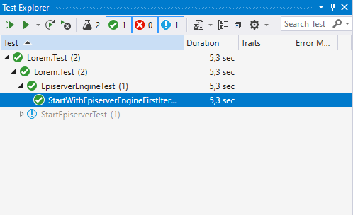

To start Optimizely CMS 12, we used `WebApplicationFactory<TEntryPoint>` and this class is a good base that we can extend on to get a service that has the full responsibility to manage Optimizely CMS 12.

## First iteration

The first iteration of the service could be called `EpiserverEngineFirstIteration<TEntryPoint>` and lets it inherit from `WebApplicationFactory<TEntryPoint>`. We can move the code from the previous test case into a Start method.

```csharp
public class EpiserverEngineFirstIteration<TEntryPoint>
    : WebApplicationFactory<TEntryPoint> where TEntryPoint : class
{
	private bool _started;

 	public void Start()
	{
		if(_started)
        {
            return;
        }

        var repository = Services.GetInstance(typeof(IContentRepository));
        
        if (repository == null)
        {
            throw new InvalidOperationException("Failed starting");
        }

        _started = true;
    }
}
```

## Create the database

An important function is that the database should be created automatically at each test session. We can add this implementation in the Start method. You can find the EpiserverEngineFirstIteration.cs file.

```csharp
public class EpiserverEngineFirstIteration<TEntryPoint>
    : WebApplicationFactory<TEntryPoint> where TEntryPoint : class
{
	private bool _started;

 	public void Start()
	{
		if(_started)
        {
            return;
        }

        CreateCmsDatabase();
        
        var repository = Services.GetInstance(typeof(IContentRepository));
        
        if (repository == null)
        {
            throw new InvalidOperationException("Failed starting");
        }

        _started = true;
    }
        
    private void CreateCmsDatabase() 
    {
        ...
    }
}
```

## Create a test case

To test `EpiserverEngineFirstIteration<TEntryPoint>`, create a new test case that, for example, creates a page.

> If you want to be able to log in, you also need to create a user, you can find the code in EpiserverEngineTest.cs.

```csharp
[Fact]
public async void StartWithEpiserverEngineFirstIteration_CreateStartPage_HasPage()
{
    EpiserverEngineFirstIteration<Startup> engine = new();
    engine.Start();

    await CreateUser("Administrator", "Administrator123#", "loremipsumdonec@supersecretpassword.io", Roles.Administrators);

    IContentRepository repository = ServiceLocator.Current.GetInstance<IContentRepository>();

    var startPage = repository.GetDefault<StartPage>(ContentReference.RootPage);

    startPage.Name = "Start";
    startPage.Heading = "Welcome to Lorem";
    startPage.StartPublish = DateTime.Now;

    repository.Save(startPage, SaveAction.Publish, AccessLevel.NoAccess);

    var pages = repository.GetChildren<StartPage>(ContentReference.RootPage);
    Assert.Single(pages);
}
```

If you run the test it should succeed.



> Much of the code we use here is the same as needed for CMS 11, the only difference is that we are now extending an existing class with these features.

